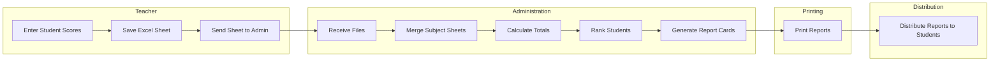

# BPMN Process Diagram
## Current Grading Workflow

```mermaid
flowchart LR

subgraph Teacher
A[Enter Student Scores]
B[Save Excel Sheet]
C[Send Sheet to Admin]
end

subgraph Administration
D[Receive Files]
E[Merge Subject Sheets]
F[Calculate Totals]
G[Rank Students]
H[Generate Report Cards]
end

subgraph Printing
I[Print Reports]
end

subgraph Distribution
J[Distribute Reports to Students]
end

A --> B
B --> C
C --> D
D --> E
E --> F
F --> G
G --> H
H --> I
I --> J
```