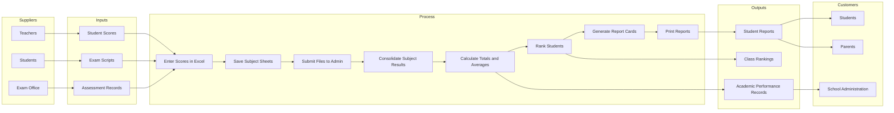

# SIPOC Diagram
## Student Grading and Report Generation Process
### Aim High School Complex

The SIPOC diagram provides a high-level overview of the grading process by identifying Suppliers, Inputs, Process steps, Outputs, and Customers.

