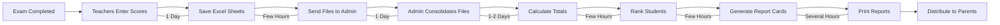

# Value Stream Map
## Student Grading Process

The value stream map identifies the flow of activities and highlights where delays occur.

```mermaid
flowchart LR

A[Exam Completed] --> B[Teachers Enter Scores]

B --> C[Save Excel Sheets]

C --> D[Send Files to Admin]

D --> E[Admin Consolidates Files]

E --> F[Calculate Totals]

F --> G[Rank Students]

G --> H[Generate Report Cards]

H --> I[Print Reports]

I --> J[Distribute to Parents]

%% Time indicators
B ---|1 Day| C
C ---|Few Hours| D
D ---|1 Day| E
E ---|1-2 Days| F
F ---|Few Hours| G
G ---|Few Hours| H
H ---|Several Hours| I
```