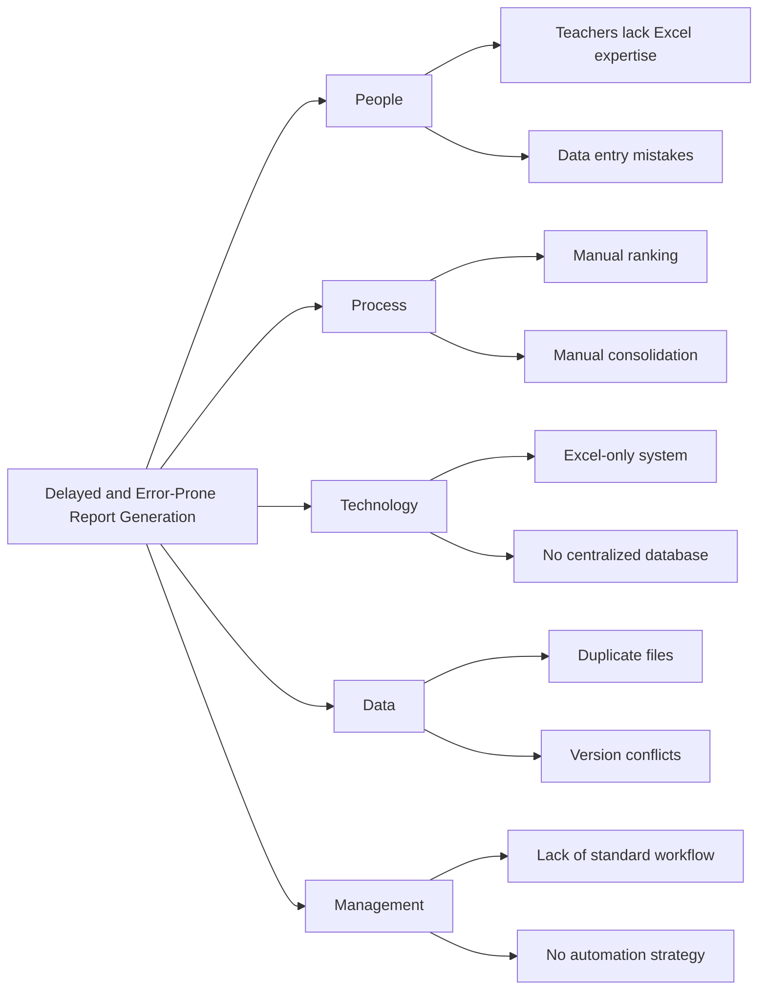

# Root Cause Analysis
## Grading System Problems

The Fishbone Diagram identifies possible root causes of inefficiencies in the grading process.

```mermaid
flowchart LR

A[Delayed and Error-Prone Report Generation]

A --> B[People]
A --> C[Process]
A --> D[Technology]
A --> E[Data]
A --> F[Management]

B --> B1[Teachers lack Excel expertise]
B --> B2[Data entry mistakes]

C --> C1[Manual ranking]
C --> C2[Manual consolidation]

D --> D1[Excel-only system]
D --> D2[No centralized database]

E --> E1[Duplicate files]
E --> E2[Version conflicts]

F --> F1[Lack of standard workflow]
F --> F2[No automation strategy]
```