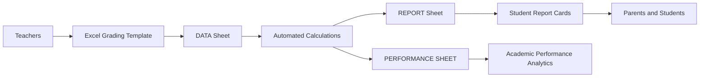

# Proposed Grading System Architecture

```mermaid
flowchart LR

A[Teachers] --> B[Excel Grading Template]

B --> C[DATA Sheet]

C --> D[Automated Calculations]

D --> E[REPORT Sheet]

D --> F[PERFORMANCE SHEET]

E --> G[Student Report Cards]

F --> H[Academic Performance Analytics]

G --> I[Parents and Students]
```