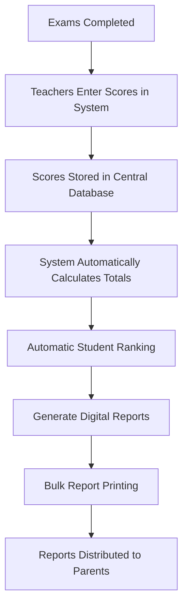

# TO-BE Process
## Improved Grading Workflow

---

# 1. Introduction

The TO-BE process describes the **future improved grading system** that addresses the inefficiencies identified in the AS-IS process.

---

# 2. Objectives of the New Process

The redesigned grading system aims to:

- Reduce grading errors
- Eliminate file duplication
- Automate calculations
- Generate reports faster
- Improve transparency

---

# 3. TO-BE Process Flow

# 4. Improvements Over Current Process
| Aspect                  | Current Process          | Improved Process          |
|-------------------------|--------------------------|---------------------------|
| Data Storage            | Excel spreadsheets       | Centralized system        |
| Calculations            | Manual calculations      | Automated calculations    |
| Ranking                 | Manual ranking           | Automatic ranking         |
| Report Generation       | Slow report generation   | Instant report generation |

# 5. Expected Benefits

- Faster report preparation

- Reduced human error

- Improved data accuracy

- Better performance tracking