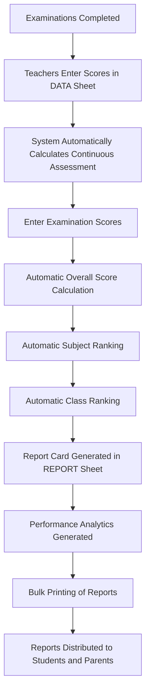

# TO-BE Process Diagram
## Improved Grading Workflow Using Excel Template

```mermaid
flowchart TD

A[Examinations Completed]

A --> B[Teachers Enter Scores in DATA Sheet]

B --> C[System Automatically Calculates Continuous Assessment]

C --> D[Enter Examination Scores]

D --> E[Automatic Overall Score Calculation]

E --> F[Automatic Subject Ranking]

F --> G[Automatic Class Ranking]

G --> H[Report Card Generated in REPORT Sheet]

H --> I[Performance Analytics Generated]

I --> J[Bulk Printing of Reports]

J --> K[Reports Distributed to Students and Parents]
```