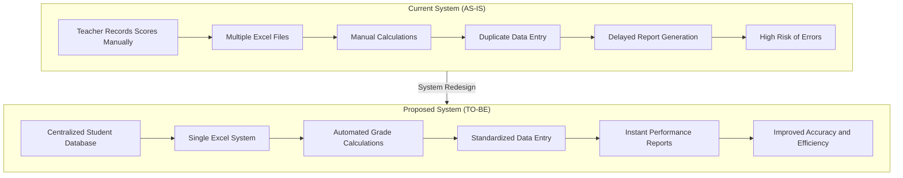

# DCIT307 Team Project Workflow  
## Aim High School Grading Process Improvement

This document presents the **full team workflow, responsibilities, and system transformation** for the Aim High School grading process improvement project.

It includes:

- Team swimlane workflow
- AS-IS vs TO-BE process comparison
- Member explanatory notes
- Presentation guidance

---

# 1. Team Swimlane Workflow Diagram

This diagram shows **who did what throughout the project lifecycle**.

```mermaid
flowchart LR

%% Steve
subgraph M1["Steve – Project Setup & Coordination"]
A1[Form Team]
A2[Review DCIT307 Requirements]
A3[Select Aim High School Case Study]
A4[Contact School IT Department]
A5[Create GitHub Repository]
A6[Define Project Folder Structure]

A1 --> A2 --> A3 --> A4 --> A5 --> A6
end


%% Hamdiyah
subgraph M2["Hamdiyah – Stakeholder Analysis"]
B1[Identify Stakeholders]
B2[Interview Teachers]
B3[Interview Administrative Staff]
B4[Document Current Grading Methods]
B5[Record Stakeholder Needs]

B1 --> B2 --> B3 --> B4 --> B5
end


%% Elijah
subgraph M3["Elijah – AS-IS System Analysis"]
C1[Map Current Grading Workflow]
C2[Create AS-IS Process Diagram]
C3[Document Manual Score Entry]
C4[Identify Workflow Bottlenecks]
C5[Analyse File Management Issues]

C1 --> C2 --> C3 --> C4 --> C5
end


%% Christybhell
subgraph M4["Christybhell – Metrics & Pain Points"]
D1[Measure Process Time]
D2[Estimate Error Rates]
D3[Identify Duplicate Data Entry]
D4[Create Pain Point Register]
D5[Perform Root Cause Analysis]

D1 --> D2 --> D3 --> D4 --> D5
end


%% Mensah Bismark
subgraph M5["Mensah Bismark – Solution Design"]
E1[Evaluate Improvement Options]
E2[Design TO-BE Process]
E3[Design Improved Workflow]
E4[Create System Architecture]
E5[Define Implementation Plan]

E1 --> E2 --> E3 --> E4 --> E5
end


%% TEAM COLLABORATION
subgraph TEAM["Team Collaboration – Prototype Development"]
F1[Develop Excel Grading System]
F2[Create Student Database Sheet]
F3[Create Marks Entry Sheet]
F4[Automate Grade Calculations]
F5[Generate Performance Reports]
F6[Write Project Documentation]
F7[Prepare Presentation]
F8[Final Class Presentation]

F1 --> F2 --> F3 --> F4 --> F5 --> F6 --> F7 --> F8
end

%% CONNECTIONS
A6 --> B1
B5 --> C1
C5 --> D1
D5 --> E1
E5 --> F1
```

---

# 2. AS-IS vs TO-BE System Comparison

This diagram shows the **current system used by the school and the improved system proposed by the team**.

---

# 3. Team Member Explanatory Notes

These notes help each team member **understand their role and defend their work during the presentation.**

---

# Steve – Project Setup & Coordination

### Responsibilities
- Organized the team and defined roles.
- Reviewed DCIT307 project requirements.
- Identified Aim High School as the case organization.
- Communicated with the school IT department.
- Created the GitHub repository for collaboration.

### Contribution to the Project
This role ensured the **project environment was structured and organized** so that the team could collaborate efficiently.

### How to Explain in Class

> “My role focused on project coordination and setup. I created the GitHub repository and structured the project documentation so that our team could collaborate effectively throughout the project lifecycle.”

---

# Elijah – Stakeholder Analysis

### Responsibilities
- Identified all stakeholders involved in the grading process.
- Conducted discussions with teachers and administrative staff.
- Documented how grades are currently managed.

### Stakeholders Identified
- Teachers
- Administrative staff
- School management
- Students
- IT support staff

### Key Findings
- Teachers spend a lot of time calculating grades manually.
- There is no centralized system for storing results.

### How to Explain in Class

> “My role was stakeholder analysis. I identified the individuals involved in the grading process and documented their needs and challenges.”

---

# Hamdiyah – AS-IS System Analysis

### Responsibilities
- Analysed the **current grading process used by the school**.
- Created the AS-IS process diagram.
- Documented the workflow for entering and calculating grades.

### Problems Identified
- Multiple spreadsheets are used.
- Calculations are done manually.
- Data is not centralized.

### How to Explain in Class

> “I analysed the current grading system used by the school and documented the workflow. This helped us understand the inefficiencies in the existing system.”

---

# Christybhell – Metrics & Pain Point Analysis

### Responsibilities
- Measured the performance of the current system.
- Identified operational inefficiencies.

### Pain Points Identified

1. High risk of calculation errors  
2. Time-consuming grade compilation  
3. Duplicate data entry  
4. Poor file organization  

### How to Explain in Class

> “My role focused on analysing the weaknesses of the current system by identifying measurable issues such as time delays and error risks.”

---

# Mensah Bismark – Solution Design

### Responsibilities
- Designed the improved system (TO-BE process).
- Proposed automation using an Excel-based grading system.
- Developed the system architecture and implementation plan.

### Key Improvements
- Automated grade calculations
- Centralized student records
- Standardized reporting

### How to Explain in Class

> “My role was designing the improved grading system. Based on the issues discovered, we proposed a centralized Excel system that automates calculations and generates performance reports.”

---

# 4. Team Collaboration – System Prototype

All team members contributed to developing the **Excel grading system prototype**.

### Features Implemented

1. Student registration sheet  
2. Marks entry sheet  
3. Automated grade calculations  
4. Class performance dashboard  
5. Teacher summary reports  

---

# 5. How to Defend the Project in Class

The presentation should follow this order:

### Step 1 – Project Introduction
Explain the organization and the grading problem.

### Step 2 – Stakeholder Analysis
Describe who uses the system and their needs.

### Step 3 – AS-IS Process
Explain how the grading system currently works.

### Step 4 – Pain Points
Discuss the problems identified.

### Step 5 – TO-BE Solution
Explain the improved grading system.

### Step 6 – Prototype
Demonstrate the Excel system developed.

---

# 6. Project Outcome

The redesigned system provides:

- Faster grade processing
- Reduced calculation errors
- Improved report generation
- Better data organization

This solution improves **efficiency and reliability in managing student academic records** at Aim High School.